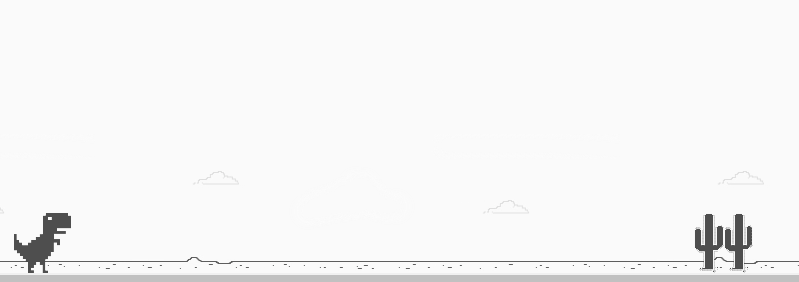

# Dino game

Jogo feito em HTML + CSS + JavaScript, a partir do Bootcamp Órbi Web Games Developer, promovido no dio.me
Foram feitas algumas alterações na dinâmica/mecânica do jogo.
As alterações tiveram foco em deixar o jogo mais responsivo e diminuir, um pouco, a dificuldade.
Ainda, foi adicionado ao dino uma animação de pulo.

